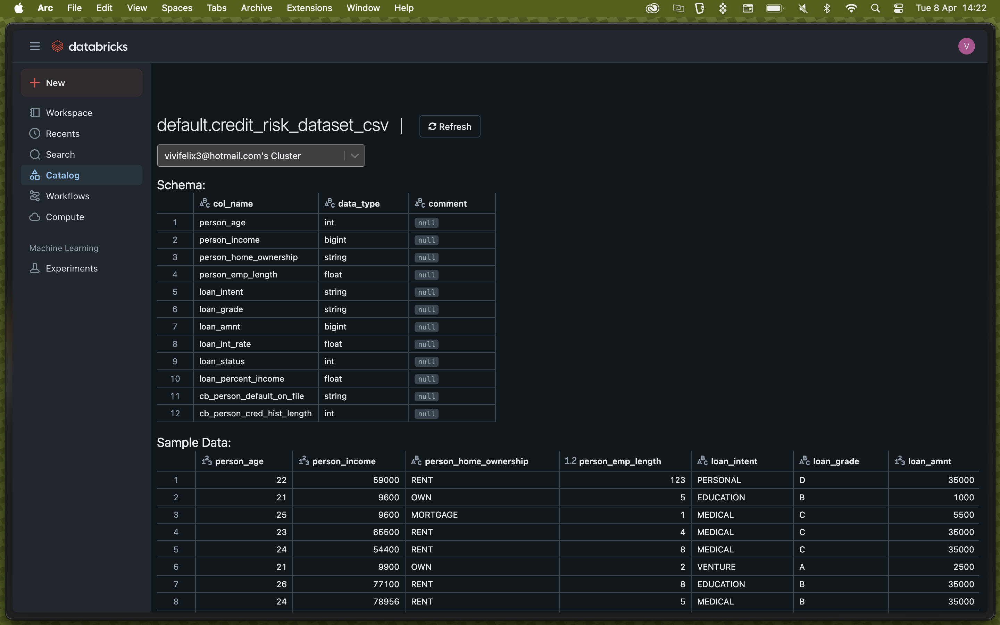
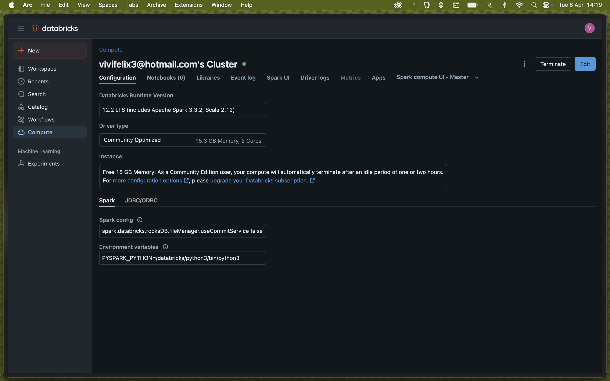
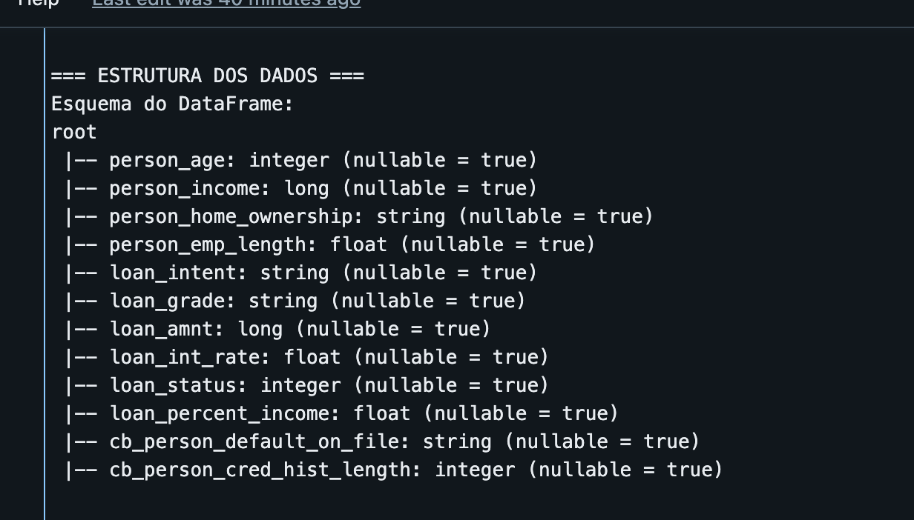
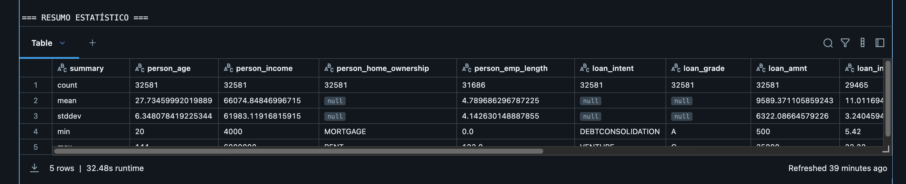
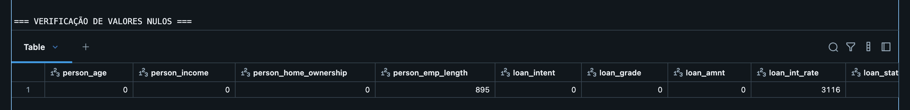
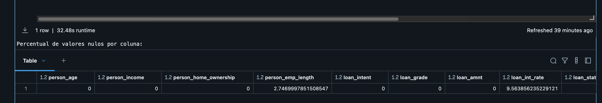
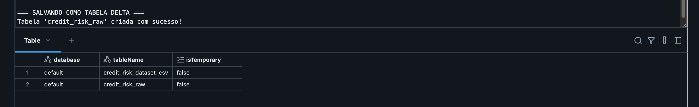

# Catálogo de Dados - Análise de Crédito Bancário

## Linhagem dos Dados
* **Fonte Original**: [Credit Risk Dataset](https://www.kaggle.com/datasets/laotse/credit-risk-dataset) do Kaggle
* **Método de Coleta**: Download manual e upload para o DBFS (Databricks File System)
* **Data de Extração**: Abril de 2025
* **Formato Original**: CSV (Comma Separated Values)

## Ambiente Computacional

## Modelo Dimensional
Este catálogo descreve o modelo dimensional em Esquema Estrela criado para análise de risco de crédito bancário.

### Dimensão Cliente (dim_cliente)

| Atributo | Tipo de Dado | Descrição | Domínio | Valores Mínimos/Máximos |
|----------|--------------|-----------|---------|------------------------|
| cliente_id | Long | Identificador único do cliente (surrogate key) | Número inteiro positivo | 0 - n |
| person_age | Integer | Idade da pessoa em anos | Número inteiro | 18 - 100 anos |
| person_income | Double | Renda anual da pessoa | Número decimal | 0 - 10.000.000 |
| person_home_ownership | String | Status de propriedade da residência | Categórico | MORTGAGE, OWN, RENT, OTHER |
| person_emp_length | Double | Tempo de emprego em anos | Número decimal | 0 - 65 anos |
| historico_inadimplencia | String | Se a pessoa tem histórico de inadimplência | Categórico | Y (sim), N (não) |
| tempo_historico_credito | Integer | Tempo em anos que a pessoa tem histórico de crédito | Número inteiro | 0 - 50 anos |

### Dimensão Empréstimo (dim_emprestimo)

| Atributo | Tipo de Dado | Descrição | Domínio | Valores Mínimos/Máximos |
|----------|--------------|-----------|---------|------------------------|
| emprestimo_id | Long | Identificador único do empréstimo (surrogate key) | Número inteiro positivo | 0 - n |
| loan_intent | String | Finalidade declarada do empréstimo | Categórico | EDUCATION, MEDICAL, VENTURE, PERSONAL, HOMEIMPROVEMENT, DEBTCONSOLIDATION |
| loan_grade | String | Grau de classificação do empréstimo | Categórico | A, B, C, D, E, F, G |
| loan_amnt | Double | Valor do empréstimo em dólares | Número decimal | 0 - 100.000 |
| loan_int_rate | Double | Taxa de juros do empréstimo (percentual) | Número decimal | 0 - 30% |
| loan_percent_income | Double | Valor do empréstimo como percentual da renda anual | Número decimal | 0 - 1.0 (0 - 100%) |
| loan_status | Integer | Status do empréstimo (1 = inadimplente, 0 = adimplente) | Binário | 0, 1 |

### Tabela de Fatos - Análise de Crédito (fato_analise_credito)

| Atributo | Tipo de Dado | Descrição | Domínio | Valores Mínimos/Máximos |
|----------|--------------|-----------|---------|------------------------|
| cliente_id | Long | Chave estrangeira para dimensão cliente | Número inteiro positivo | 0 - n |
| emprestimo_id | Long | Chave estrangeira para dimensão empréstimo | Número inteiro positivo | 0 - n |
| tempo_id | Integer | Chave estrangeira para dimensão tempo | Número inteiro positivo | 1 |
| status_emprestimo | Integer | Status do empréstimo | Binário | 0 (adimplente), 1 (inadimplente) |
| valor_emprestimo | Double | Valor do empréstimo em dólares | Número decimal | 0 - 100.000 |
| taxa_juros | Double | Taxa de juros do empréstimo (percentual) | Número decimal | 0 - 30% |
| percentual_renda | Double | Valor do empréstimo como percentual da renda anual | Número decimal | 0 - 1.0 (0 - 100%) |
| flag_inadimplencia | Integer | Indicador de inadimplência (calculado) | Binário | 0 (adimplente), 1 (inadimplente) |

## Observações de Qualidade de Dados

### Estrutura dos Dados

### Estatísticas Descritivas

### Análise de Valores Nulos

### Armazenamento em Delta Lake

* Os valores nulos foram identificados e tratados durante a fase de análise de qualidade
* Para campos numéricos sem valores, foi aplicada a média ou mediana conforme adequado
* Para campos categóricos sem valores, foi aplicada a moda ou uma categoria "Desconhecido"
* Outliers foram identificados usando método do Z-score ou IQR e tratados caso a caso
