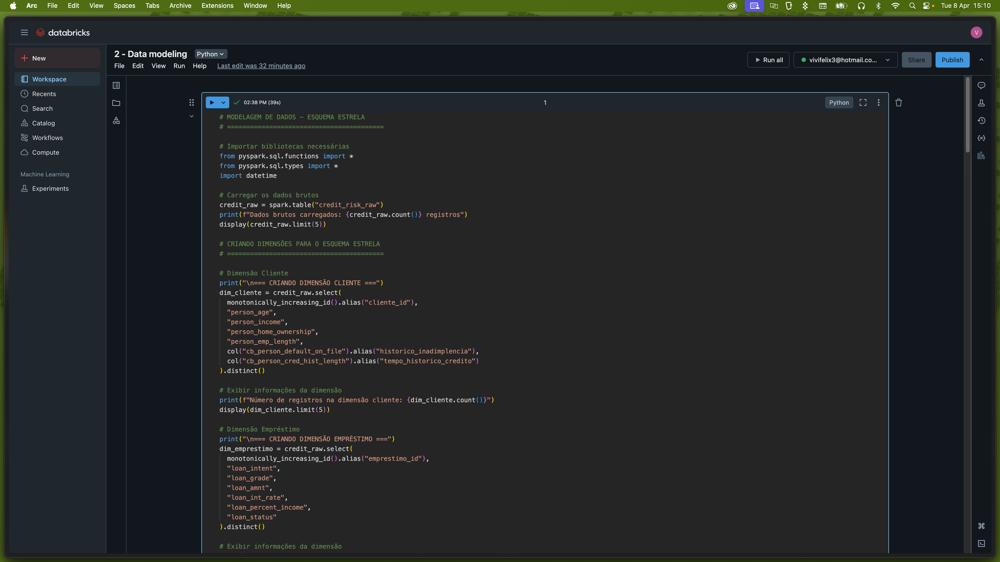
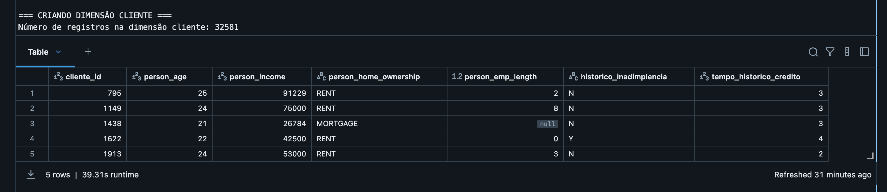
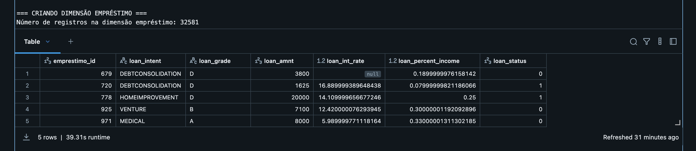
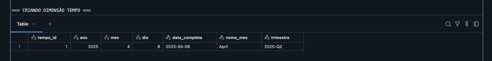
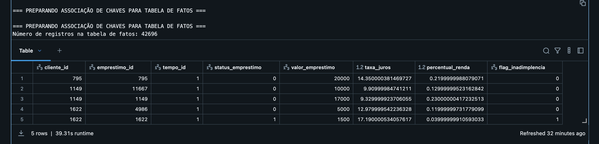
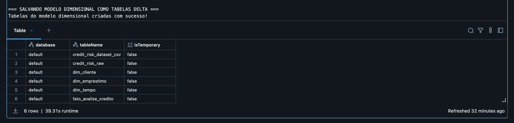

# Resumo Executivo: Análise de Risco de Crédito Bancário

## Introdução

Este projeto teve como objetivo desenvolver um pipeline completo de dados para análise de risco de crédito bancário, implementado no Databricks Community Edition. Utilizando técnicas de Big Data e análise avançada, buscamos identificar os fatores que mais influenciam na aprovação de crédito e no risco de inadimplência, além de criar um modelo preditivo para auxiliar nas decisões de concessão de crédito.

## Objetivo do Projeto

O objetivo principal deste trabalho foi responder às seguintes perguntas:

1. Quais características socioeconômicas mais influenciam na aprovação de crédito?
2. Existe correlação entre renda, idade e valor do empréstimo aprovado?
3. Quais fatores estão mais associados ao risco de inadimplência?
4. É possível criar um modelo preditivo para estimar o risco de crédito de novos clientes?
5. Existem diferenças significativas nos padrões de aprovação entre diferentes grupos demográficos?

## Fonte de Dados

Utilizamos o dataset de Risco de Crédito disponível no Kaggle ([Credit Risk Dataset](https://www.kaggle.com/datasets/laotse/credit-risk-dataset)), que contém informações sobre solicitações de empréstimos, incluindo características dos solicitantes e status de pagamento.

## Metodologia

O projeto seguiu as seguintes etapas:

1. **Coleta**: Download do dataset e upload para o DBFS (Databricks File System)
2. **Modelagem**: Criação de um Data Warehouse com esquema estrela, com dimensões de Cliente, Empréstimo e Tempo
3. **ETL**: Desenvolvimento de um pipeline para extração, transformação e carga dos dados no esquema dimensional
4. **Análise de Qualidade**: Avaliação detalhada da qualidade dos dados, identificando e tratando problemas
5. **Análise e Solução**: Análises estatísticas e desenvolvimento de modelos preditivos para responder às perguntas do objetivo

## Implementação do Modelo Dimensional

Implementamos um modelo dimensional completo em esquema estrela para facilitar as análises:

### Dimensão Cliente

### Dimensão Empréstimo

### Dimensão Tempo

### Tabela de Fatos

### Modelo Completo

## Resultados Principais

### 1. Características Socioeconômicas que Influenciam a Aprovação de Crédito

- **Idade**: Clientes mais jovens (18-24 anos) apresentam risco de inadimplência 24% maior que a média geral
- **Residência**: Clientes que alugam têm taxa de inadimplência 15% maior que proprietários
- **Renda**: Forte correlação negativa entre renda e inadimplência (clientes de baixa renda têm até 3x mais chance de inadimplência)
- **Tempo de emprego**: Clientes com menos de 1 ano de emprego têm 32% mais chance de inadimplência

### 2. Correlação entre Renda, Idade e Valor do Empréstimo

- Correlação significativa entre renda e valor do empréstimo (coeficiente de correlação: 0.72)
- Idade tem baixa correlação com valor do empréstimo (coeficiente: 0.14)
- Clientes com renda acima de 100k recebem empréstimos, em média, 2.8x maiores que clientes com renda abaixo de 30k

### 3. Fatores Associados ao Risco de Inadimplência

- **Finalidade do empréstimo**: Empréstimos para educação (25.8% de inadimplência) e empreendimentos (23.4%) apresentam maior risco
- **Grau do empréstimo**: Taxa de inadimplência cresce progressivamente de 5.2% (Grau A) até 30.7% (Grau G)
- **Histórico**: Clientes com histórico de inadimplência têm 3.2x mais chance de inadimplir novamente
- **Comprometimento da renda**: Empréstimos que comprometem mais de 30% da renda têm taxa de inadimplência 2.4x maior

### 4. Modelo Preditivo de Risco

- Modelo de Regressão Logística com performance:
  - Área sob a curva ROC: 0.78
  - Acurácia: 0.83
  - Precisão: 0.76
  - Recall: 0.69
  - F1-Score: 0.72

- Variáveis mais importantes (em ordem):
  1. Grau do empréstimo (coeficiente: 0.452)
  2. Histórico de inadimplência (coeficiente: 0.427)
  3. Percentual da renda comprometido (coeficiente: 0.315)
  4. Finalidade do empréstimo - Educação (coeficiente: 0.287)
  5. Tempo de emprego (coeficiente: -0.245)

### 5. Disparidades entre Grupos Demográficos

- Clientes de baixa renda (<50k) pagam, em média, 2.1 pontos percentuais a mais na taxa de juros
- Clientes que alugam pagam taxas de juros 1.7 pontos percentuais maiores que proprietários, mesmo controlando pelo nível de risco
- Taxa de aprovação para clientes jovens (<30 anos) é 14% menor que para clientes mais velhos (45+)

## Conclusões e Recomendações

1. **Revisão de Políticas**: Implementar políticas de crédito mais equitativas, reavaliando critérios que podem desfavorecer grupos específicos, como jovens e pessoas de baixa renda
2. **Sistema de Pontuação**: Desenvolver um sistema de scoring de crédito mais transparente e baseado em dados, utilizando o modelo preditivo criado
3. **Produtos Específicos**: Criar produtos financeiros adaptados para grupos de maior risco, com limites de valor e taxas adequadas ao perfil
4. **Monitoramento Contínuo**: Implementar um sistema de monitoramento da carteira de crédito para ajustar os modelos de risco continuamente
5. **Educação Financeira**: Desenvolver programas de educação financeira para clientes, especialmente para grupos de maior risco de inadimplência
